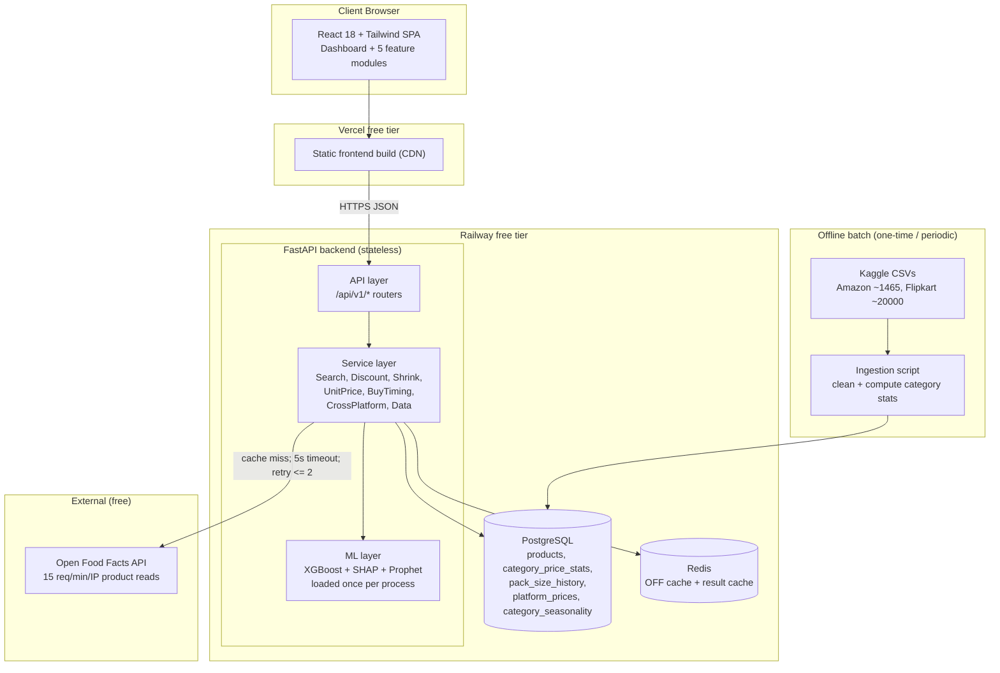
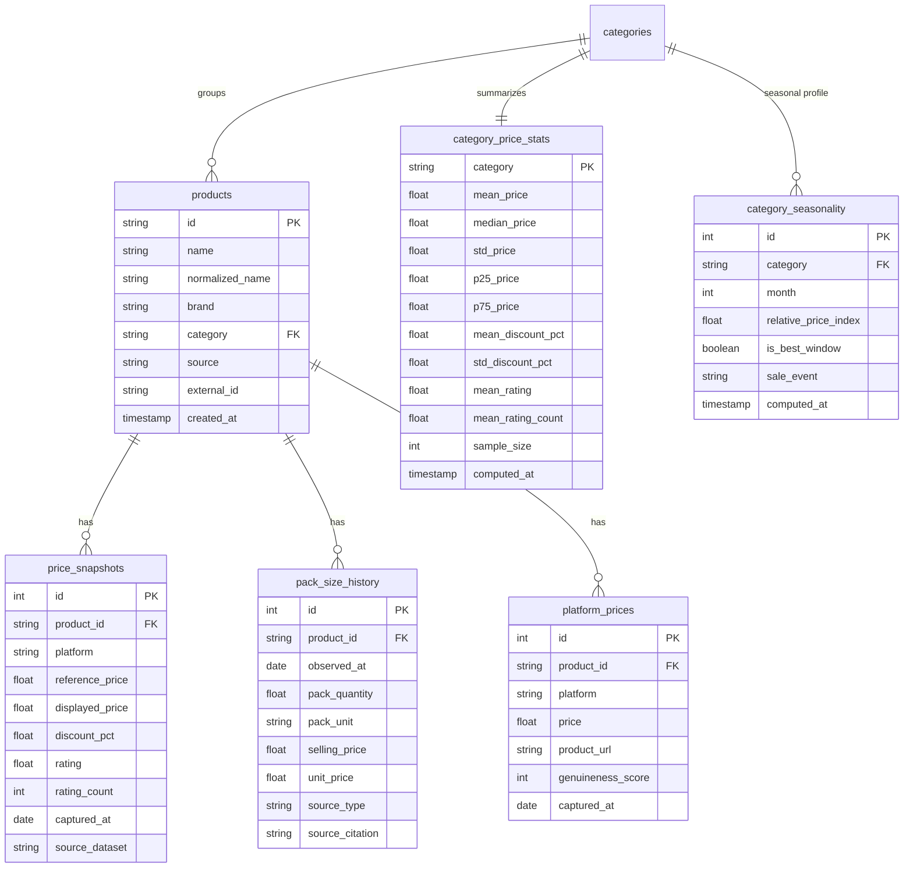
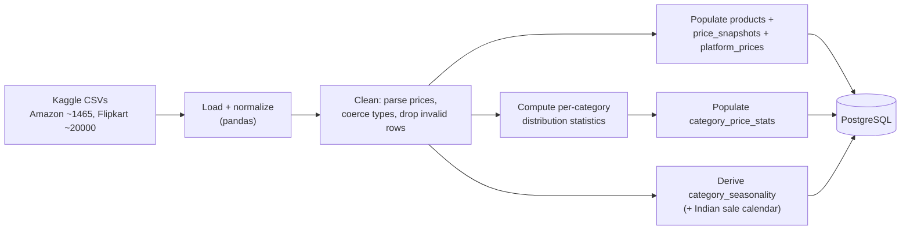

# Design Document

## Overview

Price Truth is a web platform that brings pricing transparency to Indian e-commerce. It exposes five analysis modules — True Discount Checker, Shrinkflation Timeline, Unit Price Comparator, Buy Timing Signal, and Cross-Platform Aggregator — behind a single product-search entry point and a cohesive dashboard. This document describes how the platform is built on top of the existing Phase 0 scaffolding to satisfy all 19 requirements (10 functional, 9 non-functional) in `requirements.md`.

The design is shaped by three fixed constraints, which appear as recurring design decisions rather than afterthoughts:

- **Zero budget** — only free tools and free tiers (Vercel + Railway). This drives the caching-first, single-process, stateless architecture that survives on constrained infrastructure.
- **No manual data collection** — all data is sourced automatically from Kaggle datasets (ingested once) and the Open Food Facts (OFF) public API (queried live and cached). Live scraping of Amazon/Flipkart is not a core dependency (Req 10.4).
- **Snapshot data** — public datasets are point-in-time snapshots, not per-product daily time series. This is the single most important technical constraint: it forces the discount model to be built on **category-level price statistics** rather than per-product price history, and forces the Buy Timing module to make **category-level** recommendations rather than per-SKU forecasts. The platform discloses this openly (Req 6.4, 10.1) rather than hiding it.

### Key Design Decisions

| Decision | Choice | Rationale | Requirements |
|---|---|---|---|
| Discount model input | Engineered features derived from **category price statistics** | Snapshot data has no per-product price history; category distributions are the only statistically sound baseline | 2.3, 6.3 |
| Discount labels | Transparent weak-supervision from category price distribution | No public dataset labels "fake discounts"; the labeling rule is disclosed as a limitation | 2.3, 10.1, 10.2 |
| Explainability | SHAP `TreeExplainer` on the trained XGBoost model | Locally accurate and additive; contributions reconcile to the score, which is the trust guarantee the project is built around | 3.1–3.5 |
| Live product data | OFF API, cached in Redis, with bulk CSV fallback | OFF enforces 15 req/min/IP on product reads; caching plus bulk export is mandatory to stay within limits | 9.2, 9.4, 12.3 |
| Buy timing granularity | Category-level seasonality plus Indian sale-calendar prior | Honest given snapshot data; still useful | 6.3, 6.4, 10.1 |
| Backend shape | Stateless FastAPI handlers, one model per process | Enables free-tier scaling and horizontal replication | 12.2, 12.4 |
| Failure model | Per-module error containment | One broken module must not break the dashboard | 8.5, 15.1 |

### Research Summary

Two external dependencies were researched because the design leans on their documented behavior:

1. **Open Food Facts API** — The public API enforces rate limits of 15 requests/min/IP for product reads (`GET /api/v*/product`) and 10 requests/min/IP for search, returning HTTP 503 when global abuse limits are hit; it requires a custom `User-Agent`, and recommends downloading bulk CSV/JSONL exports for more than a few hundred products ([OFF API documentation](https://openfoodfacts.github.io/openfoodfacts-server/api/)). The database is licensed under the [Open Database License (ODbL)](https://world.openfoodfacts.org/data), with individual contents under the Database Contents License. v3.6 is the current version and v2 is deprecated but still supported, so the client version is configurable via environment variable. *Content was rephrased for compliance with licensing restrictions.* These facts drive the Redis caching strategy, the 5-second timeout with bounded retries, the crowd-sourced-data disclosure (Req 10.3), and the source attribution on OFF-derived data (Req 4.4).
2. **SHAP** — SHAP is a locally accurate, additive feature-attribution method: for a single prediction, the model's base (expected) value plus the sum of per-feature SHAP contributions equals the model output, and `TreeExplainer` enforces this with an internal additivity check ([SHAP TreeExplainer docs](https://shap.readthedocs.io/en/stable/generated/shap.TreeExplainer.html)). Additivity is exact in the model's margin (log-odds) space for a binary classifier. This is the basis for the reconciliation requirement (Req 3.3) and the corresponding correctness property.

## Architecture

The platform is a layered web application: a React single-page app talks over HTTPS/JSON to a stateless FastAPI backend organized into an API layer, a service layer, an ML layer, and a data layer. Postgres is the durable store, Redis is the cache, and Open Food Facts is the only live external dependency. Kaggle data is ingested offline into Postgres by a batch script.



### Layer Responsibilities

- **API layer (`app/api/v1/`)** — FastAPI routers. Owns request/response schemas (Pydantic), input validation, rate limiting, CORS, and structured error translation. No business logic. (Req 17.5, 18.1)
- **Service layer (`app/services/`)** — One service per feature plus `DataService`. Owns business logic, caching decisions, and orchestration. Pure-Python and unit-testable in isolation. (Req 17.5)
- **ML layer (`app/ml/`)** — Model loading, feature engineering, inference, and SHAP explanation. The model and its `TreeExplainer` are loaded once at process start and reused. (Req 2.3, 12.4)
- **Data layer (`app/db/`)** — SQLAlchemy models, session management, repositories (parameterized queries only), and the Redis client. (Req 17.5, 18.2)

### Deployment Topology

- **Frontend** to Vercel free tier (static build, CDN, HTTPS). (Req 13.3, 18.5)
- **Backend + Postgres + Redis** to Railway free tier. (Req 13.3)
- All environment-specific values (DB URL, Redis URL, OFF base URL/version, allowed CORS origin) come from environment variables via `pydantic-settings`; no secrets in the repo. (Req 13.1, 13.4, 18.6)
- `docker-compose.yml` runs the whole stack locally with one command for parity with production. (Req 13.2)

### End-to-End Request Flow: Discount Check

This is the platform's most complex path and exercises validation, caching, the data layer, and the ML layer together.

```mermaid
sequenceDiagram
    participant U as React client
    participant A as FastAPI router
    participant DS as DiscountService
    participant C as Redis
    participant DB as PostgreSQL
    participant M as ML layer (XGBoost + SHAP)

    U->>A: POST /api/v1/discount-check {product_id, displayed, reference}
    A->>A: Validate (Pydantic types + ranges), rate-limit, CORS
    A->>DS: check_discount(...)
    DS->>C: GET discount:{category}:{displayed}:{reference}
    alt Cache hit
        C-->>DS: cached {score, band, breakdown}
    else Cache miss
        DS->>DB: SELECT category_price_stats WHERE category = ?
        alt Stats found
            DB-->>DS: mean/median/std price, discount norms, rating norms
            DS->>DS: engineer features
            DS->>M: predict_proba + TreeExplainer(features)
            M-->>DS: p(genuine), base_value, shap_values
            DS->>DS: score = round(p*100); band; plain-language contributions
            DS->>C: SETEX discount:{key} (TTL)
        else Stats missing
            DS-->>A: limited-verification result (no score, Req 2.6)
        end
    end
    DS-->>A: result payload
    A-->>U: 200 JSON {displayed, reference, effective_discount, score, classification, breakdown}
```

The pre-condition checks in Req 2.5 (reference missing or not greater than displayed) are enforced at the validation boundary before any cache or model work happens.

## Components and Interfaces

### Backend Module Map

```
backend/app/
  main.py                 # app factory, middleware (CORS, rate limit), router registration, startup model load
  core/
    config.py             # pydantic-settings; all env vars (Req 13.1, 18.6)
    errors.py             # ErrorPayload model + exception handlers (Req 15.3)
    logging.py            # structured logging config (Req 15.4)
  api/v1/
    search.py             # Req 1
    discount.py           # Req 2, 3
    shrinkflation.py      # Req 4
    unit_price.py         # Req 5
    buy_timing.py         # Req 6
    cross_platform.py     # Req 7
    dashboard.py          # Req 8 (composite)
    meta.py               # /health (Req 16), /api/v1/data-sources (Req 10.2)
  services/
    search_service.py
    discount_service.py
    shrinkflation_service.py
    unit_price_service.py
    buy_timing_service.py
    cross_platform_service.py
    data_service.py       # OFF client + cache + validation (Req 9, 15.2, 15.4)
  ml/
    discount_model.py     # load-once model + feature engineering + inference
    explainer.py          # SHAP TreeExplainer + plain-language labels
    seasonality.py        # category-level Prophet/statsmodels + sale calendar
    feature_labels.py     # raw feature -> human label map (Req 3.5)
  db/
    session.py            # engine, session factory, get_db dependency
    models.py             # SQLAlchemy 2.0 models
    repositories.py       # parameterized query helpers (Req 18.2)
    redis_client.py       # cache get/set with TTL
```

This preserves the Phase 0 folder layout (`api`, `core`, `db`, `ml`, `services`) and keeps each concern modifiable in isolation (Req 17.5).

### Feature Components

#### Product Search (`search_service.py`) — Req 1

Searches the `products` table by `normalized_name` using Postgres trigram/`ILIKE` matching, returning name, brand, and category for each match within the 3-second budget (Req 1.1, 1.2). An empty query returns a prompt message (Req 1.4); zero matches returns a no-results message plus a manual-entry affordance (Req 1.5). A selected product is returned as a `SelectedProduct` object that every feature module accepts as input (Req 1.3). Manual entry accepts name, displayed price, reference price, and pack quantity (Req 1.6) and is routed through the same validation as searched products.

#### True Discount Checker (`discount_service.py` + `ml/discount_model.py`) — Req 2

- **Feature engineering (snapshot-aware).** Given displayed price `P_d`, reference price `P_r`, and category `C` with statistics `S`, the model consumes features derived from category distributions rather than product history:
  - `claimed_discount_pct = (P_r - P_d) / P_r`
  - `discount_vs_category_z = (claimed_discount_pct - S.mean_discount_pct) / S.std_discount_pct`
  - `displayed_price_z = (P_d - S.mean_price) / S.std_price`
  - `reference_price_z = (P_r - S.mean_price) / S.std_price` (a high value flags an inflated "original")
  - `displayed_vs_median = P_d / S.median_price`
  - `reference_vs_p75 = P_r / S.p75_price`
  - `rating_norm`, `rating_count_log`, `rating_vs_category` (review signals)
- **Model.** An XGBoost binary classifier (`genuine` vs `inflated`) trained on the ingested Amazon/Flipkart rows. Because no public dataset labels fake discounts, labels are produced by a transparent weak-supervision rule: a row is labeled `inflated` when its reference price is a statistical outlier above the category distribution while its discounted price sits near the category norm (the "discount" is manufactured by inflating the reference), and `genuine` when the discounted price is genuinely below the category norm with a reference inside the normal band. This labeling heuristic is disclosed in the data-sources panel as a limitation (Req 10.1, 10.2).
- **Score and bands.** The model's probability of `genuine`, `p`, maps to `genuineness_score = round(p * 100)`, always within [0, 100] (Req 2.1). Classification bands (Req 2.2): `genuine` for score ≥ 90, `moderate` for 60 ≤ score < 90, `likely_inflated` for score < 60.
- **Output.** The response includes displayed price, reference price, effective discount percentage, and the classification (Req 2.4).
- **Pre-conditions and gaps.** If the reference price is missing or ≤ displayed price, the service reports that a discount cannot be evaluated and states the reason (Req 2.5). If category statistics are unavailable, it returns a limited-verification result with price context and no score (Req 2.6).
- **Persistence and reuse.** The trained model is serialized to `data/models/discount_model.pkl` (joblib) and loaded once into app state at startup, then reused across requests (Req 2.3, 12.4).

#### SHAP Explainability (`ml/explainer.py`) — Req 3

A single `shap.TreeExplainer` is constructed from the same loaded model instance that produces the score (Req 3.4). For each prediction it returns the base (expected) value and the per-feature SHAP contributions. Because SHAP is additive, `base_value + sum(shap_values)` reconciles to the model's margin output, which maps to the displayed score; the response returns both the base value and the final score so the contributions reconcile (Req 3.3). Each contribution reports its feature, magnitude, and direction (`toward_genuine` / `toward_inflated`) (Req 3.2). Raw feature names are mapped through `feature_labels.py` to plain-language labels (Req 3.5), e.g. `reference_price_z` becomes "How inflated the 'original' price looks vs. the category". The waterfall is computed in margin (log-odds) space where additivity is exact, then presented alongside the probability-based score.

#### Shrinkflation Timeline (`shrinkflation_service.py`) — Req 4

Reads `pack_size_history` for the selected product and returns, in chronological order, the pack quantity and selling price at each recorded time point (Req 4.1) plus the computed unit price at each point (Req 4.2). When two or more points exist, it computes total percentage change in pack quantity and in unit price across the full period (Req 4.3). Each data point carries its source attribution (OFF or a cited public record) (Req 4.4). Sources: the current pack size can come from OFF's `quantity` field; historical pack sizes come from curated, cited public records (e.g., documented shrinkflation of well-known FMCG products) seeded into the table. If a product has no recorded history, the service returns an unavailable message (Req 4.5).

#### Unit Price Comparator (`unit_price_service.py`) — Req 5

A pure function over two or more variants. Each variant's pack quantity is converted to a common standard unit — grams for solids, millilitres for liquids (kg to g and L to ml multiply by 1000) — before computing unit price (Req 5.4). Unit price = price / quantity-in-standard-unit for each variant (Req 5.1). The variant with the lowest unit price is marked best value (Req 5.2). The comparison view returns each variant's price, pack quantity, and computed unit price (Req 5.3). Any variant with a missing or non-positive quantity is excluded and reported in an `excluded` list with a reason (Req 5.5). This component is the most property-testable in the platform.

#### Buy Timing Signal (`buy_timing_service.py` + `ml/seasonality.py`) — Req 6

Every recommendation is expressed at the **category level**, never for a single product on a single future date (Req 6.3). The service reads a per-category seasonal profile from `category_seasonality`, built by combining any temporal signal available in the ingested data with the Indian sale calendar (Big Billion Days, Republic Day Sale, Diwali, Prime Day) (Req 6.5). Where a category-level monthly discount index can be constructed, a Prophet/statsmodels seasonal fit identifies the trough window; otherwise the service falls back to the sale-calendar prior. It returns `buy_now` or `wait` (Req 6.1); a `wait` result includes the seasonal window with the historically largest reductions (Req 6.2). Every recommendation carries a statement that it is category-level and derived from snapshot data (Req 6.4). If no seasonal pattern exists for the category, it states that a timing recommendation is unavailable (Req 6.6).

#### Cross-Platform Aggregator (`cross_platform_service.py`) — Req 7

Reads `platform_prices` for the product and returns the available price on each Supported Platform for which data exists (Req 7.1). With two or more prices it marks the lowest as the best deal (Req 7.2). Each entry includes a product-page link (Req 7.3) and, where a genuineness score exists for that listing, the score alongside it (Req 7.4). If only one platform has data, it shows the single price and states that no comparison is available (Req 7.5); if no platform has data, it returns an unavailable message (Req 7.6). Platform data comes from the ingested Kaggle datasets (Amazon, Flipkart primarily; Croma/Tata CLiQ/Reliance where present), never from live scraping (Req 10.4).

### API Endpoints

All endpoints are under `/api/v1`, return JSON (Req 14.4), and emit the structured error payload (Req 15.3) on failure. Interactive docs are auto-generated at `/docs` and `/redoc` (Req 17.4).

| Method | Path | Purpose | Requirements |
|---|---|---|---|
| GET | `/health` | Liveness plus DB/Redis connectivity check | 16.1, 16.4 |
| GET | `/api/v1/search?q={query}` | Product search | 1.1–1.5 |
| POST | `/api/v1/manual-entry` | Manual product entry (name, displayed, reference, pack qty) | 1.6 |
| POST | `/api/v1/discount-check` | Genuineness score + classification + SHAP breakdown | 2, 3 |
| GET | `/api/v1/shrinkflation/{product_id}` | Pack-size timeline + unit-price change + attribution | 4 |
| POST | `/api/v1/unit-price/compare` | Per-unit comparison across variants | 5 |
| GET | `/api/v1/buy-timing/{category}` | Category-level buy-now/wait recommendation | 6 |
| GET | `/api/v1/cross-platform/{product_id}` | Per-platform prices + best deal | 7 |
| GET | `/api/v1/dashboard/{product_id}` | Composite of all five modules (per-module error isolation) | 8 |
| GET | `/api/v1/data-sources` | Data sources + known limitations disclosure | 10.2, 10.3, 10.4 |

#### Example: `POST /api/v1/discount-check`

Request:
```json
{
  "product_id": "amz_B08XYZ",
  "category": "electronics/headphones",
  "displayed_price": 1499.0,
  "reference_price": 4999.0
}
```

Success (200):
```json
{
  "displayed_price": 1499.0,
  "reference_price": 4999.0,
  "effective_discount_pct": 70.0,
  "genuineness_score": 42,
  "classification": "likely_inflated",
  "explanation": {
    "base_value": 55.0,
    "final_score": 42,
    "contributions": [
      {"feature": "How inflated the 'original' price looks vs. the category", "impact": -18.5, "direction": "toward_inflated"},
      {"feature": "Size of the claimed discount vs. the category norm", "impact": -9.2, "direction": "toward_inflated"},
      {"feature": "Review volume", "impact": 4.1, "direction": "toward_genuine"}
    ]
  }
}
```

Limited verification when category stats are unavailable (200, Req 2.6):
```json
{
  "displayed_price": 1499.0,
  "reference_price": 4999.0,
  "effective_discount_pct": 70.0,
  "genuineness_score": null,
  "classification": "verification_limited",
  "message": "Category price statistics are unavailable for this product; showing available price context only.",
  "price_context": {"displayed_price": 1499.0, "reference_price": 4999.0}
}
```

Cannot evaluate (422, Req 2.5):
```json
{
  "error": {
    "code": "DISCOUNT_NOT_EVALUABLE",
    "message": "A discount cannot be evaluated because the reference price is missing or is not greater than the displayed price.",
    "status": 422
  }
}
```

#### Example: `POST /api/v1/unit-price/compare`

Request:
```json
{
  "variants": [
    {"label": "Small", "price": 45.0, "quantity": 100, "unit": "g"},
    {"label": "Family", "price": 199.0, "quantity": 1, "unit": "kg"},
    {"label": "Broken", "price": 60.0, "quantity": 0, "unit": "g"}
  ]
}
```

Response (200):
```json
{
  "standard_unit": "g",
  "comparison": [
    {"label": "Small", "price": 45.0, "quantity_std": 100, "unit_price": 0.45},
    {"label": "Family", "price": 199.0, "quantity_std": 1000, "unit_price": 0.199, "best_value": true}
  ],
  "excluded": [
    {"label": "Broken", "reason": "non_positive_quantity"}
  ]
}
```

### Frontend / Dashboard Design

The dashboard is a single React SPA route that renders all five modules as cards in a compact grid so a desktop user sees each module's primary result on one screen without scrolling (Req 8.1, 8.2).

Component tree:
```
App
 |- SearchPage                 (Product_Search: query box, results list, manual-entry form)
 \- DashboardPage
     |- ProductHeader          (name, brand, category)
     |- DisclosureBanner       (snapshot-data + crowd-sourced notice, Req 10.1, 10.3)
     |- FeatureGrid
     |   |- DiscountCheckerCard   -> ShapWaterfall (Plotly)     Req 2, 3
     |   |- ShrinkflationCard     -> TimelineChart (Recharts)   Req 4
     |   |- UnitPriceCard         -> UnitPriceBars               Req 5
     |   |- BuyTimingCard         -> SeasonalityView             Req 6
     |   \- CrossPlatformCard     -> PlatformBars                Req 7
     \- DataSourcesPanel        (Req 10.2, 10.4)
Shared: Card, LoadingSkeleton, UnavailableState, ErrorBoundary, FocusableControl
```

Interaction and presentation rules:
- **Compact and expandable** — each card shows the primary conclusion first (the classification label, the best-value variant, and so on); hover or keyboard activation expands the card to reveal detail (charts, tables) using `framer-motion` (Req 8.3, 19.4).
- **Loading** — each module shows an independent `react-loading-skeleton` while its request is in flight, so a slow module never blocks the others (Req 8.4).
- **Per-module unavailable state** — if a module returns no result, its card renders `UnavailableState` with the module's message instead of the result. An `ErrorBoundary` around each card contains render errors so one module cannot blank the dashboard (Req 8.5, 15.1).
- **Responsive breakpoints** (Tailwind) — single column at ≤480px, tablet layout 481–1023px without horizontal scroll, multi-column desktop grid at ≥1024px (Req 14.1, 14.2, 14.3).
- **Accessibility** — text label plus color for every classification (Req 19.2); a visible keyboard focus indicator on all controls (Req 19.3); a descriptive text alternative for every chart via an off-screen summary and `aria-label` (Req 19.5); color tokens chosen to meet 4.5:1 (normal text) and 3:1 (large text) contrast (Req 19.1). Full WCAG AA conformance also depends on manual assistive-technology testing, which is part of the QA plan rather than something the code alone can guarantee.

## Data Models

### Relational Schema (PostgreSQL)



Notes on the schema:
- **`category_price_stats`** is the backbone of the discount model. Because data is snapshot-level, per-product history does not exist; the platform reduces the ingested rows to per-category distribution statistics that the model consumes as features (Req 2.3). It is recomputed only when data is re-ingested.
- **`price_snapshots`** stores the raw per-product observations from Kaggle. `captured_at` is honest about being a snapshot date, not a continuous series.
- **`pack_size_history`** carries `source_type` (`off` or `cited_public_record`) and `source_citation` so every timeline point can display attribution (Req 4.4).
- **`platform_prices.genuineness_score`** is nullable so the aggregator can show a score next to a platform only when one exists (Req 7.4).
- **`category_seasonality`** stores the category-level seasonal profile and the mapped Indian sale event per best window (Req 6.2, 6.5).

### SQLAlchemy 2.0 Model (representative)

```python
from datetime import datetime
from sqlalchemy import String, Float, Integer, ForeignKey
from sqlalchemy.orm import DeclarativeBase, Mapped, mapped_column, relationship

class Base(DeclarativeBase):
    pass

class CategoryPriceStats(Base):
    __tablename__ = "category_price_stats"
    category: Mapped[str] = mapped_column(String, primary_key=True)
    mean_price: Mapped[float] = mapped_column(Float)
    median_price: Mapped[float] = mapped_column(Float)
    std_price: Mapped[float] = mapped_column(Float)
    p25_price: Mapped[float] = mapped_column(Float)
    p75_price: Mapped[float] = mapped_column(Float)
    mean_discount_pct: Mapped[float] = mapped_column(Float)
    std_discount_pct: Mapped[float] = mapped_column(Float)
    mean_rating: Mapped[float] = mapped_column(Float)
    mean_rating_count: Mapped[float] = mapped_column(Float)
    sample_size: Mapped[int] = mapped_column(Integer)
    computed_at: Mapped[datetime] = mapped_column(default=datetime.utcnow)
```

All database access goes through repository helpers that use SQLAlchemy's parameter binding; user input is never concatenated into SQL strings (Req 18.2).

### Redis Cache Model

| Key pattern | Value | TTL | Requirements |
|---|---|---|---|
| `off:product:{barcode}` | Validated OFF product JSON | 24h | 9.4, 12.3 |
| `search:{sha1(query)}` | Search results list | 1h | 12.3 |
| `discount:{category}:{displayed}:{reference}` | Score + band + SHAP breakdown | 1h | 11.1, 12.3 |
| `category_stats:{category}` | Category statistics row | Until next ingestion | 12.3 |
| `crossplatform:{product_id}` | Platform price comparison | 6h | 12.3 |

The cache is the primary performance lever: a cache hit skips the database, the model, and any OFF call, which is what makes the 500 ms p95 target achievable (Req 11.1). Because the cache is keyed purely by inputs and the value is a deterministic function of those inputs, a cached response is identical to a freshly computed one within the cache validity period (Req 9.4, 12.3) — a property verified in the Correctness Properties section.

### Data Pipeline: Kaggle Ingestion (offline batch)

A script under `data/scripts/` performs a one-time (re-runnable) ingestion:



Cleaning steps: strip currency symbols and thousands separators, coerce numeric fields, drop rows with non-positive prices, clamp discount percentage to [0, 100], and normalize category labels into the `categories` dimension. The resulting `category_price_stats` is what the trained model and live requests read.

### Open Food Facts Client and Validation (runtime)

`data_service.py` wraps OFF access with the constraints the API documents:
- **Endpoint** — `GET {OFF_BASE_URL}/api/{OFF_VERSION}/product/{barcode}.json`, with `OFF_BASE_URL` and `OFF_VERSION` from env vars (default v2 per the glossary; upgradeable to v3.6 without code changes).
- **Identification** — a custom `User-Agent` of the form `PriceTruth/1.0 (contact-email)` on every request, as OFF requires.
- **Timeout and retries** — 5-second timeout (Req 9.2); at most 2 retries with backoff before returning a data-unavailable status (Req 15.2).
- **Caching** — results cached in Redis under `off:product:{barcode}` for 24h to stay well within the 15 req/min/IP product-read limit; bulk needs use the OFF CSV/JSONL export rather than live calls.
- **Missing fields** — the client returns available fields and marks each missing field as unavailable rather than failing (Req 9.1).
- **Validation** — every returned value is validated against expected type and range before it reaches a feature module; values that fail validation are rejected and the rejection is logged (Req 9.5, 15.4).

### Pydantic Validation Models

Request and response bodies are Pydantic v2 models enforcing type, length, and range at the API boundary before any processing (Req 18.1). Examples:

```python
from pydantic import BaseModel, Field, field_validator

class DiscountCheckRequest(BaseModel):
    product_id: str | None = Field(default=None, max_length=128)
    category: str = Field(min_length=1, max_length=128)
    displayed_price: float = Field(gt=0)
    reference_price: float | None = Field(default=None, gt=0)

    @field_validator("reference_price")
    @classmethod
    def reference_must_exceed_displayed(cls, v, info):
        # Req 2.5 pre-condition surfaced as a structured 422 downstream when violated.
        return v

class VariantIn(BaseModel):
    label: str = Field(min_length=1, max_length=64)
    price: float = Field(gt=0)
    quantity: float                    # non-positive handled by exclusion, not rejection (Req 5.5)
    unit: str = Field(pattern="^(g|kg|ml|l)$")
```

Validation failures are converted by a central exception handler into the structured error payload rather than FastAPI's default shape, so all errors share one contract (Req 15.3).

## Correctness Properties

*A property is a characteristic or behavior that should hold true across all valid executions of a system — essentially, a formal statement about what the system should do. Properties serve as the bridge between human-readable specifications and machine-verifiable correctness guarantees.*

These properties are derived from the acceptance-criteria prework. Criteria classified as infrastructure/latency (Performance, Availability, most of Portability/Maintainability), pure UI rendering, and one-off configuration are intentionally excluded here and covered by integration, snapshot, and smoke tests in the Testing Strategy. Redundant criteria were consolidated (see the notes on each property).

### Property 1: Search results always carry identifying fields

*For any* product corpus and *any* query that returns matches, every returned match includes a non-empty product name, brand, and category.

**Validates: Requirements 1.2**

### Property 2: Genuineness score is always within range

*For any* discount-check input for which category statistics exist, the returned genuineness score is an integer in the closed interval [0, 100].

**Validates: Requirements 2.1**

### Property 3: Discount band is a correct total function of the score

*For any* score in [0, 100], the classifier assigns exactly one band, where score ≥ 90 is `genuine`, 60 ≤ score < 90 is `moderate`, and score < 60 is `likely_inflated`. Boundary scores 59, 60, 89, and 90 fall in the band dictated by these thresholds.

**Validates: Requirements 2.2**

### Property 4: Effective discount percentage identity

*For any* displayed price and reference price with reference > displayed, the reported effective discount percentage equals (reference − displayed) / reference × 100 within a small numeric tolerance, and the response also echoes the displayed price and reference price.

**Validates: Requirements 2.4**

### Property 5: A discount cannot be evaluated without a valid reference

*For any* input where the reference price is missing or is not strictly greater than the displayed price, the checker returns a not-evaluable result with a stated reason and never returns a genuineness score.

**Validates: Requirements 2.5**

### Property 6: SHAP breakdown is complete and plainly labelled

*For any* scored discount result, the contribution breakdown contains exactly one entry per model feature, and every entry's displayed label is drawn from the plain-language label map and is never a raw model feature identifier.

**Validates: Requirements 3.1, 3.5**

### Property 7: SHAP contribution direction matches its sign

*For any* contribution in a breakdown, its direction is `toward_genuine` when the contribution increases the score and `toward_inflated` when it decreases the score.

**Validates: Requirements 3.2**

### Property 8: SHAP contributions reconcile to the result

*For any* scored discount result, the base (expected) value plus the sum of all feature contributions equals the model's margin output within a small tolerance, and the response presents both the base value and the final score so the breakdown reconciles.

**Validates: Requirements 3.3**

### Property 9: Shrinkflation timeline is ordered and attributed

*For any* product with recorded pack-size history, the returned points are in non-decreasing chronological order, and every point carries a non-empty source attribution.

**Validates: Requirements 4.1, 4.4**

### Property 10: Unit price identity at each timeline point

*For any* recorded pack-size point with a positive pack quantity, the displayed unit price equals selling price divided by pack quantity within a small tolerance.

**Validates: Requirements 4.2**

### Property 11: Total pack-size and unit-price change identity

*For any* pack-size history with two or more points, the reported total percentage change in pack quantity equals (last − first) / first × 100 for quantity, and likewise for unit price.

**Validates: Requirements 4.3**

### Property 12: Unit price identity per variant

*For any* set of variants with positive standardized quantities, each variant's computed unit price equals its price divided by its quantity expressed in the standard unit, within a small tolerance.

**Validates: Requirements 5.1**

### Property 13: Best value is the minimum unit price

*For any* set of two or more included variants, the variant marked best value has a unit price equal to the minimum unit price in the set and no included variant has a lower unit price.

**Validates: Requirements 5.2**

### Property 14: Unit-price comparison is invariant to unit scale

*For any* variant, expressing its pack quantity in kilograms versus grams (or litres versus millilitres) yields the same computed unit price and leaves the best-value selection unchanged. Converting a quantity to the standard unit and back recovers the original quantity within tolerance.

**Validates: Requirements 5.4**

### Property 15: Invalid-quantity variants are excluded, valid ones included once

*For any* list of variants, every variant with a missing or non-positive pack quantity appears in the excluded list with a reason and never in the comparison, and every remaining variant appears in the comparison exactly once.

**Validates: Requirements 5.5**

### Property 16: Buy-timing output is category-level, bounded, and disclosed

*For any* category with a seasonal profile, the recommendation is one of `buy_now` or `wait`, the payload is scoped to the category (it contains no single-product single-date prediction), and it always includes the statement that the recommendation is category-level and derived from snapshot data.

**Validates: Requirements 6.1, 6.3, 6.4, 10.1**

### Property 17: A "wait" recommendation points to the deepest-discount window

*For any* seasonal profile that yields a `wait` recommendation, the displayed window is the window with the largest historical price reduction in that profile.

**Validates: Requirements 6.2**

### Property 18: Cross-platform entries mirror available data

*For any* set of platform prices, the returned entries correspond exactly to the Supported Platforms that have data; each entry carries a non-empty product link; and each entry shows a genuineness score if and only if the underlying listing has one, matching its value.

**Validates: Requirements 7.1, 7.3, 7.4**

### Property 19: Best deal is the minimum platform price

*For any* set of two or more platform prices, the entry marked best deal has a price equal to the minimum price in the set and no entry has a lower price.

**Validates: Requirements 7.2**

### Property 20: Missing OFF fields degrade gracefully

*For any* Open Food Facts response with an arbitrary subset of fields omitted, the data service returns all present fields unchanged and marks every missing field as unavailable, without raising an error.

**Validates: Requirements 9.1**

### Property 21: Cache returns results identical to fresh computation

*For any* cacheable request, the value served from the Redis cache within its validity period is equal to the value produced by computing the request from scratch for the same key.

**Validates: Requirements 9.4, 12.3**

### Property 22: External and input values are validated before use

*For any* generated external data value or request parameter, a value that violates its expected type or range is rejected and never reaches a feature module, while every value within type and range is accepted.

**Validates: Requirements 9.5, 15.4, 18.1**

### Property 23: All error responses use the structured payload

*For any* error the platform returns, the response body conforms to the error schema, containing a human-readable message and a status code.

**Validates: Requirements 15.3**

### Property 24: OFF-derived results disclose their crowd-sourced origin

*For any* result derived from Open Food Facts data, the response indicates that the data is crowd-sourced and may be incomplete.

**Validates: Requirements 10.3**

### Property 25: Non-color and text-alternative cues are always present

*For any* rendered discount classification, the output includes the classification's text label rather than relying on color alone, and *for any* rendered chart with data, a non-empty descriptive text alternative is present.

**Validates: Requirements 19.2, 19.5**

## Non-Functional Design (Cross-Cutting)

Each non-functional requirement maps to a concrete mechanism in the design rather than a hope.

### Performance (Req 11)
- **Redis-first reads.** Every expensive path (discount score, cross-platform, OFF lookup) checks Redis before doing work; a cache hit skips DB, model, and network, which is what makes the 500 ms p95 target reachable (Req 11.1).
- **Model loaded once.** The XGBoost model and `TreeExplainer` are loaded at startup into app state, so inference and explanation avoid per-request load cost (Req 11.2, 11.3, 12.4).
- **Async I/O.** OFF calls use `httpx.AsyncClient`; DB and Redis calls are non-blocking so the event loop stays responsive under concurrency.
- **Latency budgets.** Discount inference is targeted under 3 s and SHAP under an additional 2 s (Req 11.2, 11.3); the frontend ships a code-split build to a CDN for a sub-3 s first contentful paint (Req 11.4).

### Scalability (Req 12)
- **Stateless handlers.** No per-session state is held in-process; all shared state lives in Postgres/Redis, so the backend can run multiple uvicorn workers or replicas (Req 12.2).
- **Shared cache.** Repeated same-product requests are served from Redis rather than recomputed or re-fetched (Req 12.3).
- **Bounded error rate under load.** With caching and statelessness, the 50-concurrent-user error-rate target (≤1%) is a load-test gate (Req 12.1).

### Portability (Req 13)
- **Env-var config** via `pydantic-settings` for DB URL, Redis URL, OFF base URL/version, and CORS origin (Req 13.1).
- **Containers.** `docker-compose.yml` brings up backend + Postgres + Redis with one command (Req 13.2); Vercel + Railway host the deployed tiers (Req 13.3).
- **No secrets in the repo** — `.env` is gitignored and secrets are injected by the platform (Req 13.4).

### Compatibility (Req 14)
- **Responsive Tailwind layout** with the three documented breakpoints (Req 14.1–14.3).
- **JSON everywhere** so any standards-compliant HTTP client can consume the API (Req 14.4).

### Reliability (Req 15)
- **Per-module containment.** The composite dashboard endpoint calls each feature service independently and wraps each in try/except, returning that module's unavailable payload on failure while the others succeed (Req 15.1). The frontend mirrors this with an `ErrorBoundary` per card.
- **Bounded retries.** OFF calls retry at most twice with backoff before returning data-unavailable (Req 15.2).
- **Structured errors + validation logging.** A central exception handler emits the error schema (Req 15.3), and rejected external values are logged (Req 15.4).

### Availability (Req 16)
- **Health endpoint** verifies DB and Redis connectivity (Req 16.1).
- **DB-unreachable path** returns a 503 structured payload with a retry message instead of an unhandled failure (Req 16.4).
- **Cold-start readiness** is aided by loading the model once and keeping startup lightweight (Req 16.3); 99% monthly availability is an operational monitoring target (Req 16.2).

### Maintainability (Req 17)
- **Module boundaries** (`api` / `services` / `ml` / `db`) keep each concern modifiable in isolation (Req 17.5).
- **Tests and coverage.** Discount classification, unit-price computation, and validation are covered by tests, with a ≥70% coverage gate on business-logic modules (Req 17.1, 17.2).
- **Linting.** `black` + `isort` + `flake8` (and `mypy`) for Python and `eslint` + `prettier` for JavaScript run in CI (Req 17.3).
- **Auto docs.** FastAPI serves `/docs` and `/redoc` from the route/schema definitions (Req 17.4).

### Security (Req 18)
- **Input validation** at the boundary via Pydantic (type, length, format) before processing (Req 18.1).
- **Parameterized ORM** — all queries use SQLAlchemy binding; no string concatenation of user input (Req 18.2).
- **CORS restricted** to the configured frontend origin. The Phase 0 `main.py` currently uses `allow_origins=["*"]`; this design changes it to the single configured origin from settings (Req 18.3).
- **Rate limiting** — a `slowapi` limiter enforces 60 requests/min/client, returning a rate-limit status on excess (Req 18.4). This dependency is added to `requirements.txt`.
- **HTTPS** is terminated by Vercel/Railway for all client traffic (Req 18.5).
- **Secrets via env** and never in responses (Req 18.6).

### Usability (Req 19)
- Text-plus-color classification (Req 19.2), keyboard focus indicators (Req 19.3), conclusion-before-detail ordering (Req 19.4), and chart text alternatives (Req 19.5), with a color palette selected to meet contrast ratios (Req 19.1).

## Error Handling

### Structured Error Payload

Every error, regardless of origin, is serialized by a central FastAPI exception handler into one shape (Req 15.3):

```json
{
  "error": {
    "code": "DATA_UNAVAILABLE",
    "message": "Cross-platform data is unavailable for this product.",
    "status": 503,
    "details": {}
  }
}
```

### Error Categories and Handling

| Situation | Handling | Status | Requirements |
|---|---|---|---|
| Invalid/malformed request input | Reject at Pydantic boundary; central handler emits error schema | 422 | 18.1, 15.3 |
| Discount not evaluable (bad reference) | Domain result with reason | 422 | 2.5 |
| Category stats missing | Limited-verification result (not an error) | 200 | 2.6 |
| OFF timeout/failure | Retry ≤2, then cached value if present, else data-unavailable | 200 (cached) / 503 | 9.2, 15.2 |
| Missing OFF fields | Return present fields, mark missing unavailable | 200 | 9.1 |
| External value fails validation | Reject value, log rejection, mark input unavailable | 200/503 | 9.5, 15.4 |
| One module throws in composite dashboard | Contain error; that module returns unavailable, others succeed | 200 | 15.1, 8.5 |
| Database unreachable | Service-unavailable with retry message | 503 | 16.4 |
| Rate limit exceeded | Reject excess requests | 429 | 18.4 |
| No data for feature (empty history / no platforms / no seasonality) | Module-specific unavailable message | 200 | 4.5, 6.6, 7.6, 8.5 |

### Principles
- **Fail soft, not silent.** Missing data yields a clearly-labelled unavailable state, never a blank card or a stack trace (Req 8.5, 9.3).
- **Contain blast radius.** A fault in one module never propagates to another (Req 15.1).
- **Log rejections.** Every validation rejection is written to the application log for debugging while the user still receives a clean response (Req 15.4).

## Testing Strategy

### Dual Testing Approach

The platform uses complementary layers. **Property-based tests** verify the universal invariants in the Correctness Properties across many generated inputs. **Unit tests** verify specific examples, boundary values, and error branches. **Integration, snapshot, and smoke tests** cover the criteria that are about infrastructure, latency, UI layout, and configuration rather than input-varying logic. Property tests carry the load of broad input coverage, so unit tests stay focused on concrete examples and edge cases rather than proliferating.

### Property-Based Testing

- **Libraries** (not implemented from scratch): [Hypothesis](https://hypothesis.readthedocs.io/) for the Python backend and [fast-check](https://fast-check.dev/) for the React/JavaScript frontend. `hypothesis` is added to `backend/requirements.txt` and `fast-check` to the frontend dev dependencies.
- **Iterations.** Each property test runs a minimum of 100 generated cases (Hypothesis `max_examples=100` or higher; fast-check `numRuns: 100`).
- **One test per property.** Each of the 25 correctness properties is implemented by a single property-based test.
- **Traceability tag.** Every property test carries a comment in the form:
  `# Feature: price-truth-platform, Property {number}: {property_text}`

Example (Property 13 and 14, unit-price comparator):

```python
from hypothesis import given, strategies as st, settings

units = st.sampled_from(["g", "kg", "ml", "l"])
variants = st.lists(
    st.fixed_dictionaries({
        "label": st.text(min_size=1, max_size=8),
        "price": st.floats(min_value=0.01, max_value=1e6, allow_nan=False),
        "quantity": st.floats(min_value=0.001, max_value=1e5, allow_nan=False),
        "unit": units,
    }),
    min_size=2, max_size=8,
)

# Feature: price-truth-platform, Property 13: Best value is the minimum unit price
@settings(max_examples=200)
@given(variants)
def test_best_value_is_minimum_unit_price(vs):
    result = compare_units(vs)
    included = result["comparison"]
    best = next(v for v in included if v.get("best_value"))
    assert best["unit_price"] == min(v["unit_price"] for v in included)
```

The generators deliberately produce the edge cases surfaced in prework — all-whitespace queries (Req 1.4), non-positive/missing quantities (Req 5.5), OFF payloads with arbitrary missing fields (Req 9.1), boundary scores 59/60/89/90 (Req 2.2), and out-of-range external values (Req 9.5) — so those EDGE_CASE criteria are exercised inside the property runs.

### Property-to-Test Map

| Property | Component under test | Library |
|---|---|---|
| 1 | Search result shaping | Hypothesis |
| 2, 3, 4, 5 | Discount score, bands, identity, pre-conditions | Hypothesis |
| 6, 7, 8 | SHAP breakdown, direction, reconciliation | Hypothesis |
| 9, 10, 11 | Shrinkflation ordering, unit price, % change | Hypothesis |
| 12, 13, 14, 15 | Unit-price comparator | Hypothesis |
| 16, 17 | Buy-timing recommendation | Hypothesis |
| 18, 19 | Cross-platform aggregator | Hypothesis |
| 20 | OFF missing-field handling | Hypothesis |
| 21 | Cache determinism | Hypothesis |
| 22 | Input/external validation | Hypothesis |
| 23 | Structured error payload | Hypothesis |
| 24, 25 | OFF disclosure, text/alt cues | Hypothesis (backend) / fast-check (frontend) |

### Unit Tests (examples and edge cases)

Focused example-based tests, mapped from EXAMPLE/EDGE_CASE prework items:
- Empty/whitespace query prompt (1.4); no-results + manual entry (1.5); manual-entry acceptance (1.6).
- Model wiring uses the loaded instance and category-stat features (2.3); limited verification when stats missing (2.6).
- Explainer references the scoring model instance (3.4).
- Empty pack history message (4.5); sale-calendar contains the four named events (6.5); no-seasonality message (6.6).
- Single-platform no-comparison (7.5) and no-platform unavailable (7.6).
- OFF timeout/failure with and without cache (9.2); data-unavailable propagation to a module (9.3).
- Model loaded exactly once (12.4); retry count ≤2 (15.2); DB-down 503 (16.4).

### API and Integration Tests

- **Contract tests** (FastAPI `TestClient`): each endpoint returns JSON (14.4), correct status codes, and the error schema on failure (15.3).
- **Latency/load** (Locust or k6): cache-hit p95 ≤500 ms at 50 concurrency (11.1), error rate ≤1% (12.1), discount <3 s and SHAP <2 s warm (11.2, 11.3).
- **Security**: injection strings treated as data (18.2); CORS allowed vs disallowed origin (18.3); rate-limit at 61 req/min (18.4); responses contain no secrets (18.6).
- **Availability**: `/health` returns healthy with deps up (16.1); cold-start-to-ready measurement (16.3).

### Frontend Tests

- **Component/interaction** (Vitest + React Testing Library): all five cards mount (8.1), hover/keyboard expand (8.3), loading skeletons while pending (8.4), unavailable state on empty (8.5), conclusion-before-detail order (19.4), visible focus (19.3).
- **Responsive snapshots** at 480 / 800 / 1280 px (14.1–14.3, 8.2).
- **Accessibility**: automated checks (e.g., `jest-axe`) for contrast tokens (19.1), text-plus-color labels (19.2), and chart text alternatives (19.5); full WCAG AA sign-off includes manual assistive-technology testing.
- **fast-check** property tests for pure frontend logic (classification label rendering, chart alt-text presence) backing Property 25.

### Smoke / Configuration Tests

- Config loads from env, no hardcoded endpoints (13.1); `docker compose up` brings the stack up (13.2); `.env` gitignored and secret-scan clean (13.4, 18.6); `/docs` and `/redoc` return 200 (17.4); module boundaries present (17.5).

### Quality Gates (CI)

- `pytest --cov` with a ≥70% gate on backend business-logic modules (Req 17.2), including the mandated coverage of discount classification, unit-price computation, and validation logic (Req 17.1).
- `black --check`, `isort --check`, `flake8`, `mypy` for Python and `eslint` + `prettier` for JavaScript, all zero-error (Req 17.3).
- Property tests, unit tests, and API contract tests run on every push; load and cross-browser suites run before releases.
